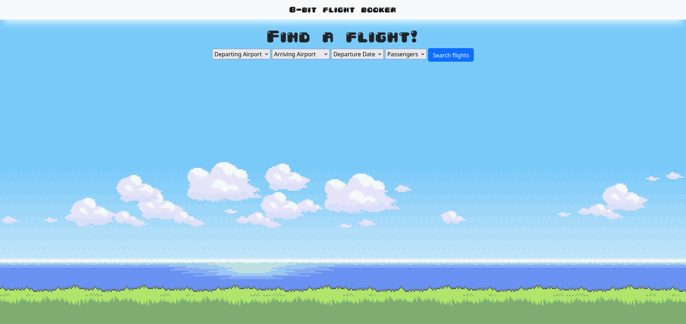
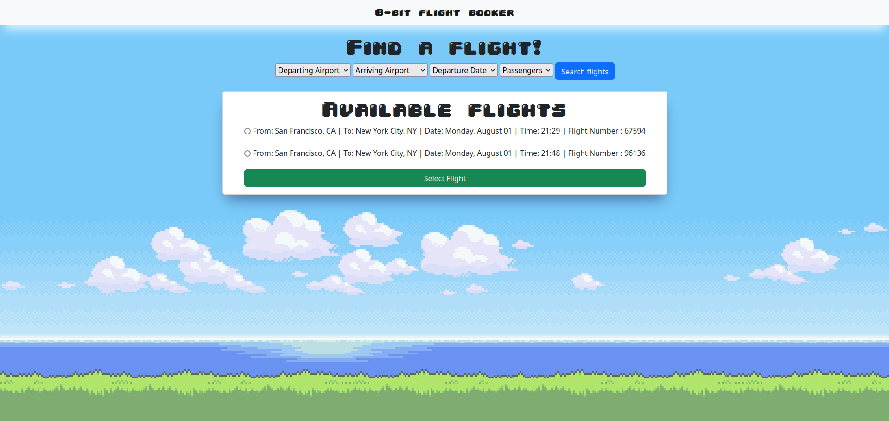
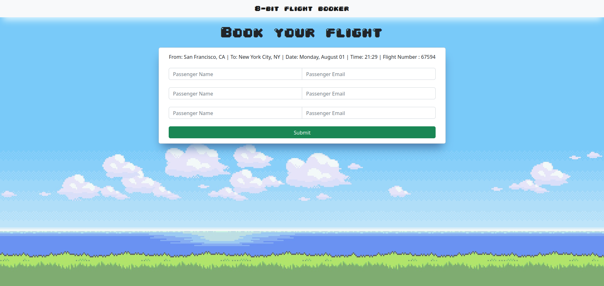
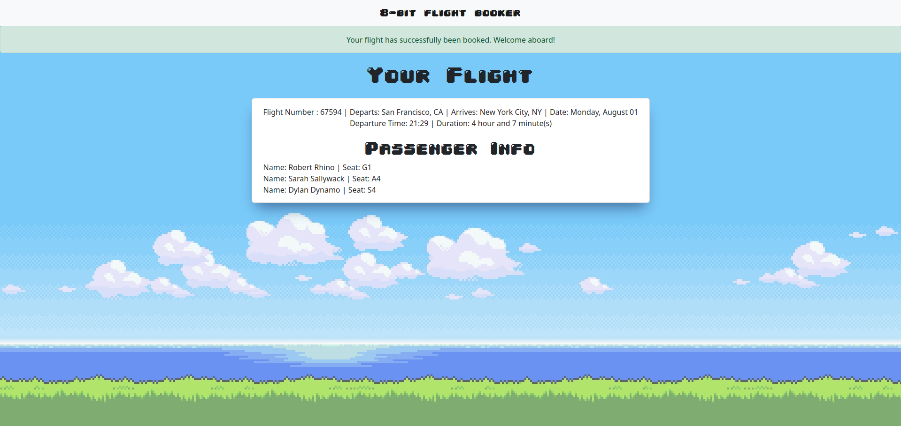
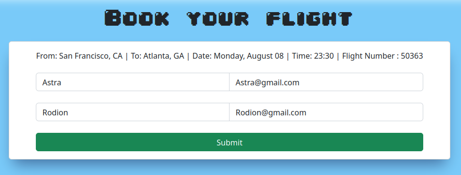
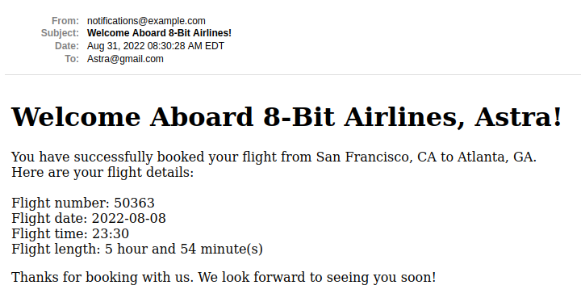
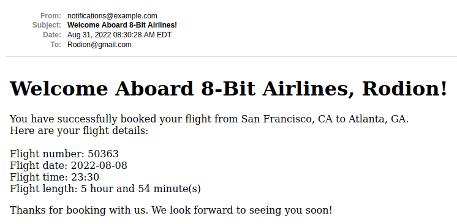

# 8-Bit Flight Booker

This is a project from the <strong>Advanced Forms and Active Record</strong> section in The Odin Project's Ruby on Rains curriculum.
The original project can be found here: [Flight Booker Project](https://www.theodinproject.com/lessons/ruby-on-rails-flight-booker)

### Functionality

- Book one-way flights on a specific date of August 2022 for up to four passengers
- Associations between 4 models Airport, Flight, Passenger, Booking
- Prepopulate drop down menus with data from multiple models
- Usage of nested attributes (submitting to multiple models with a single click)
- Seeding of 8 hardcoded airports and 3,400 flights using the Faker gem
- RSpec feature tests using Capybara and FactoryBot
- Mailer implemented for confirmation upon booking flights
- Use of letter opener for mailer development
- Styled using Bootstrap and custom CSS
- Error handling (see Heroku exception)

### Live Demo
**Heroku Exception**
There is one error handling bug on the Heroku demo. As I developed the app with SQLite and Heroku uses PostgreSQL, if a user submits the form on the home page, the site will break. However, if you clone the app locally, an alert will appear notifying the user that there are "No flights found. Please make sure you have selected an option for each field." I will be building my next apps with PostgreSQL :)

[Link to Heroku Live Demo](https://eight-bit-flight-booker.herokuapp.com/)

### Screenshots

<p float = 'left' >
  <figure>
  <figcaption>Loading/Search Page</figcaption>
  
  </figure>
  <figure>
  <figcaption>Search Results</figcaption>
  
  </figure>
  <figure>
  <figcaption>Passenger Information</figcaption>
  
  </figure>
  <figure>
  <figcaption>Final Booking</figcaption>
  
  <figcaption>Mailer</figcaption>
  When booking two passengers, it will send confirmation emails to each passenger.
  
  
  
  </figure>
</p>

### Local Installation
To get started with the app, make sure you have Rails and Git installed on your machine  
Clone the repo to your local machine: 
```ruby
$ git clone git@github.com:BrentBarnes/Odin-Flight-Booker.git
```
Then, install the needed gems:
```ruby
$ bundle install
```
Next, migrate the database:
```ruby
$ rails db:migrate
```
Load sample airports and flights:
```ruby
$ rails db:seed
```
Finally, on root path run a local server:
```ruby
$ rails server
```
Open browser to view application:
```ruby
localhost:3000
```

### Run The Tests
**Tests Include**

Search Flights
1. Valid inputs: Expect page to have content "From: San Francisco, CA | To: New York City, NY | Date: Monday, August 01"
2. Invalid inputs: Expect page to have content "No flights found. Please make sure you have selected an option for each field."

Create Passengers
1. Valid inputs: Expect page to have content "Your flight has successfully been booked. Welcome aboard!"
2. Invalid inputs: Expect page to have content "You must fill out all fields"

After local installation, run:
```ruby
$ bundle exec rspec spec/features/
```

### Data Model Associations
```ruby
class Airport < ApplicationRecord
  has_many :departing_flights, class_name: "Flight", foreign_key: :departure_airport_id
  has_many :arriving_flights, class_name: "Flight", foreign_key: :arrival_airport_id
end
class Flight < ApplicationRecord
  belongs_to :departure_airport, class_name: "Airport"
  belongs_to :arrival_airport, class_name: "Airport"
  has_many :bookings
  has_many :passengers
end
class Booking < ApplicationRecord
  belongs_to :flight
  has_many :passengers
  accepts_nested_attributes_for :passengers
end
class Passenger < ApplicationRecord
  belongs_to :booking
end
```